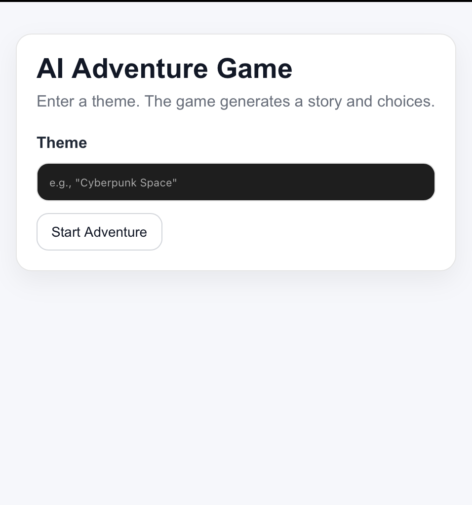

# AI-Powered Choose Your Own Adventure (Full Stack)

A web-based interactive text adventure where users enter a theme and the story + choices are generated dynamically.

## Tech Stack
- Frontend: React (Vite)
- Backend: Python (FastAPI/Flask) — in progress
- AI: OpenAI or Anthropic — planned
- DB: MongoDB — planned

## Features (Frontend)
- Theme input + start flow
- Interactive story + branching choices
- Loading + error handling
- Two-column layout with **Adventure Log** (turn history)
- API layer abstraction (`storyApi.js`) to swap mock ↔ real backend easily

## Screenshots



## Run Locally (Frontend)
```bash
cd frontend
npm install
npm run dev
